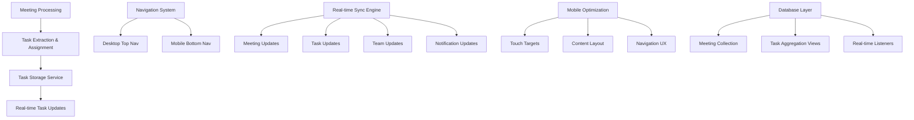

# Comprehensive System Integration - Design Document

## Overview

This design addresses the critical integration issues in the MeetingAI system by implementing a comprehensive solution that ensures tasks are properly stored and displayed, navigation is consistent across devices, real-time synchronization works seamlessly, and the mobile experience is optimized. The approach focuses on data flow consistency, proper task management, responsive navigation, and real-time updates.

## Architecture

### Current System Analysis

Based on the database screenshot and code analysis, the current issues are:

1. **Task Storage Gap**: Tasks exist as `actionItems` within meetings but aren't properly aggregated for user task views
2. **Navigation Inconsistency**: Mobile navigation exists but needs optimization for webapp experience
3. **Real-time Sync Issues**: Some components don't update in real-time when data changes
4. **Mobile UX Issues**: Bottom navigation needs refinement, content overflow issues

### Solution Architecture



## Components and Interfaces

### 1. Enhanced Task Management System

**Purpose**: Properly extract, store, and display tasks from meetings

**Interface**:
```typescript
interface TaskManagementService {
  extractTasksFromMeeting(meeting: Meeting, teamId?: string): Promise<TaskWithContext[]>;
  assignTaskToUser(taskId: string, userId: string, assignedBy: string): Promise<void>;
  getUserTasks(userId: string): Promise<TaskWithContext[]>;
  updateTaskStatus(taskId: string, status: ActionItem['status']): Promise<void>;
  subscribeToUserTasks(userId: string, callback: (tasks: TaskWithContext[]) => void): () => void;
}

interface TaskWithContext extends ActionItem {
  meetingId: string;
  meetingTitle: string;
  meetingDate: Date;
  teamId?: string;
  teamName?: string;
  assignedBy?: string;
  assignedAt?: Date;
}
```

**Implementation Strategy**:
- Extract tasks from meeting action items during processing
- Store task assignments with full context (meeting, team, assignee)
- Provide real-time task updates across all views
- Handle task reassignment by team admins

### 2. Unified Navigation System

**Purpose**: Provide consistent navigation experience across all devices

**Interface**:
```typescript
interface NavigationSystem {
  // Desktop Navigation
  renderDesktopNavigation(currentPage: string): React.ReactElement;
  
  // Mobile Navigation
  renderMobileNavigation(currentPage: string): React.ReactElement;
  
  // Navigation Items
  getNavigationItems(): NavigationItem[];
  
  // Notification Integration
  getNotificationCount(): number;
  getTaskCount(): number;
}

interface NavigationItem {
  id: string;
  label: string;
  icon: React.ComponentType;
  href: string;
  badge?: number;
  mobileOnly?: boolean;
  desktopOnly?: boolean;
}
```

**Navigation Structure**:
- **Desktop**: Top horizontal navigation with all items visible
- **Mobile**: Bottom navigation with essential items (Dashboard, Teams, Tasks, Analytics, Settings, Notifications, User, Logout)
- **Responsive**: Automatic switching based on screen size
- **Badges**: Show notification and task counts on relevant items

### 3. Real-time Synchronization Engine

**Purpose**: Ensure all data updates are reflected immediately across the application

**Interface**:
```typescript
interface RealTimeSyncEngine {
  // Meeting Synchronization
  subscribeMeetingUpdates(userId: string, callback: (meetings: Meeting[]) => void): () => void;
  subscribeTeamMeetings(teamId: string, callback: (meetings: Meeting[]) => void): () => void;
  
  // Task Synchronization
  subscribeTaskUpdates(userId: string, callback: (tasks: TaskWithContext[]) => void): () => void;
  
  // Team Synchronization
  subscribeTeamUpdates(userId: string, callback: (teams: Team[]) => void): () => void;
  
  // Notification Synchronization
  subscribeNotifications(userId: string, callback: (notifications: Notification[]) => void): () => void;
  
  // Batch Updates
  syncAllUserData(userId: string): Promise<UserDataSnapshot>;
}

interface UserDataSnapshot {
  meetings: Meeting[];
  tasks: TaskWithContext[];
  teams: Team[];
  notifications: Notification[];
  lastUpdated: Date;
}
```

### 4. Mobile-Optimized Components

**Purpose**: Provide native app-like experience on mobile devices

**Interface**:
```typescript
interface MobileOptimization {
  // Touch Targets
  ensureMinimumTouchTarget(element: HTMLElement): void;
  
  // Layout Management
  adjustForBottomNavigation(content: HTMLElement): void;
  
  // Scroll Management
  preventNavigationOverlap(): void;
  
  // Pull to Refresh
  enablePullToRefresh(onRefresh: () => Promise<void>): void;
}

interface MobileNavigationConfig {
  position: 'bottom';
  height: '64px';
  safeAreaInset: boolean;
  items: MobileNavigationItem[];
}

interface MobileNavigationItem {
  id: string;
  label: string;
  icon: React.ComponentType;
  href: string;
  badge?: number;
  active?: boolean;
}
```

## Data Models

### Enhanced Task Data Model

```typescript
interface TaskWithContext extends ActionItem {
  // Core task information
  id: string;
  description: string;
  priority: 'high' | 'medium' | 'low';
  status: 'pending' | 'in_progress' | 'completed';
  deadline?: Date;
  
  // Assignment information
  assigneeId: string;
  assigneeName: string;
  assignedBy?: string;
  assignedAt?: Date;
  
  // Context information
  meetingId: string;
  meetingTitle: string;
  meetingDate: Date;
  teamId?: string;
  teamName?: string;
  
  // Metadata
  createdAt: Date;
  updatedAt: Date;
}
```

### Navigation State Model

```typescript
interface NavigationState {
  currentPage: string;
  isMobile: boolean;
  isTablet: boolean;
  showMobileMenu: boolean;
  notificationCount: number;
  taskCount: number;
  user: User | null;
}
```

### Real-time Update Model

```typescript
interface RealTimeUpdate {
  type: 'meeting' | 'task' | 'team' | 'notification';
  action: 'create' | 'update' | 'delete';
  data: any;
  userId: string;
  timestamp: Date;
}
```

## Implementation Strategy

### Phase 1: Task System Integration

1. **Task Extraction Service**
   - Create service to extract tasks from meeting action items
   - Include full context (meeting, team, assignment details)
   - Handle task assignment and reassignment

2. **Task Storage Enhancement**
   - Enhance database queries to aggregate tasks from all user meetings
   - Implement efficient task retrieval with proper indexing
   - Add real-time task update listeners

3. **Task Display Components**
   - Update tasks page to show all user tasks with context
   - Add filtering and sorting capabilities
   - Implement task status updates with real-time sync

### Phase 2: Navigation System Unification

1. **Responsive Navigation Component**
   - Create unified navigation component that adapts to screen size
   - Implement desktop top navigation with all items
   - Implement mobile bottom navigation with essential items

2. **Mobile Navigation Optimization**
   - Ensure 44px minimum touch targets
   - Add proper spacing and safe area handling
   - Implement smooth transitions and animations

3. **Navigation State Management**
   - Centralize navigation state and current page tracking
   - Add notification and task count badges
   - Handle navigation between pages smoothly

### Phase 3: Real-time Synchronization

1. **Sync Engine Implementation**
   - Create centralized real-time sync engine
   - Implement efficient Firestore listeners
   - Handle connection states and offline scenarios

2. **Data Flow Optimization**
   - Ensure all components subscribe to relevant data updates
   - Implement efficient data caching and state management
   - Add conflict resolution for concurrent updates

3. **Performance Optimization**
   - Optimize Firestore queries and indexes
   - Implement proper cleanup of listeners
   - Add loading states and error handling

### Phase 4: Mobile Experience Enhancement

1. **Touch Optimization**
   - Ensure all interactive elements meet touch target requirements
   - Add proper touch feedback and animations
   - Implement swipe gestures where appropriate

2. **Layout Optimization**
   - Fix content overflow issues with bottom navigation
   - Implement proper safe area handling
   - Add pull-to-refresh functionality

3. **Performance Optimization**
   - Optimize for mobile performance and battery usage
   - Implement efficient scrolling and rendering
   - Add proper loading states and skeleton screens

## Error Handling

### Task System Errors

1. **Task Assignment Failures**: Retry logic with user feedback
2. **Task Sync Failures**: Offline queue with sync on reconnection
3. **Permission Errors**: Clear error messages and fallback options

### Navigation Errors

1. **Route Failures**: Fallback to dashboard with error notification
2. **State Sync Issues**: Reset navigation state with user notification
3. **Mobile Layout Issues**: Graceful degradation to basic layout

### Real-time Sync Errors

1. **Connection Failures**: Offline mode with sync on reconnection
2. **Data Conflicts**: Last-write-wins with user notification
3. **Permission Changes**: Re-authentication flow with context preservation

## Testing Strategy

### Unit Tests

- Task extraction and assignment logic
- Navigation component rendering and state management
- Real-time sync engine functionality
- Mobile optimization utilities

### Integration Tests

- End-to-end task assignment and display workflow
- Navigation between pages with state preservation
- Real-time updates across multiple components
- Mobile touch interaction and layout

### Performance Tests

- Task loading and display performance
- Navigation transition smoothness
- Real-time update latency
- Mobile scrolling and interaction performance

## Monitoring and Analytics

### Key Metrics

- Task assignment success rate
- Navigation usage patterns
- Real-time sync latency
- Mobile user engagement
- Error rates and types

### Performance Monitoring

- Page load times across devices
- Real-time update delivery times
- Database query performance
- Mobile-specific performance metrics

## Security Considerations

- Ensure task assignments respect team permissions
- Validate all navigation state changes
- Secure real-time listeners with proper authentication
- Protect against mobile-specific security vulnerabilities