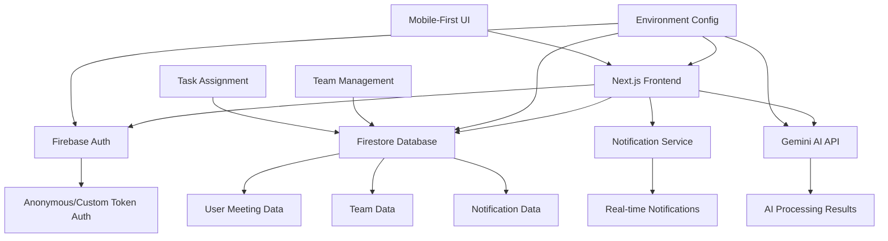

# Design Document

## Overview

This design enhances the existing MeetingAI Next.js application with mobile-first responsive design and comprehensive team collaboration features. The application will support team management, task assignment, real-time notifications, and a fully responsive interface optimized for all device sizes.

The design maintains the existing client-side architecture while adding team collaboration services, notification systems, and mobile-optimized UI components. All new features integrate seamlessly with the current Firebase and Gemini AI infrastructure.

## Architecture

### High-Level Architecture



### Data Flow

1. **Authentication Flow**: App loads → Check for custom token → Authenticate → Set user context
2. **Upload Flow**: File selected → Read content → Validate → Send to Gemini → Parse response → Auto-assign tasks → Save to Firestore
3. **Display Flow**: Dashboard loads → Fetch user meetings → Fetch team data → Display unified view → Navigate to reports
4. **Team Flow**: Create team → Search members by email → Send invitations → Handle accept/decline → Update team roster
5. **Task Assignment Flow**: Process meeting → Match speakers to team members → Auto-assign tasks → Allow manual reassignment → Send notifications

## Components and Interfaces

### Authentication Service

```typescript
interface AuthService {
  initializeAuth(): Promise<void>
  getCurrentUser(): User | null
  onAuthStateChanged(callback: (user: User | null) => void): void
}
```

**Implementation Details:**
- Check for global `__initial_auth_token` variable
- Use `signInWithCustomToken` if token exists, otherwise `signInAnonymously`
- Maintain auth state across app using React context
- Handle auth errors with user-friendly messages

### File Processing Service

```typescript
interface FileProcessor {
  readFileContent(file: File): Promise<string>
  validateFile(file: File): boolean
  processTranscript(content: string): Promise<ProcessedMeeting>
}

interface ProcessedMeeting {
  summary: string
  actionItems: ActionItem[]
  rawTranscript: string
  metadata: MeetingMetadata
}
```

**Implementation Details:**
- Use FileReader API to extract text content
- Validate file size (max 10MB) and type (.txt, .md)
- Handle encoding issues and special characters
- Provide progress feedback during processing

### Gemini AI Integration

```typescript
interface GeminiService {
  processTranscript(transcript: string): Promise<AIResponse>
  constructPrompt(transcript: string): string
}

interface AIResponse {
  summary: string
  actionItems: ActionItem[]
  confidence: number
}
```

**Prompt Design:**
```
Analyze this meeting transcript and provide a JSON response with:
1. A comprehensive summary (2-3 paragraphs)
2. Action items with suggested owners and deadlines
3. Priority levels for each action item

Format: {
  "summary": "...",
  "actionItems": [
    {
      "description": "...",
      "suggestedOwner": "...",
      "suggestedDeadline": "YYYY-MM-DD",
      "priority": "high|medium|low"
    }
  ]
}

Transcript: [TRANSCRIPT_CONTENT]
```

### Database Service

```typescript
interface DatabaseService {
  saveMeeting(userId: string, meeting: ProcessedMeeting): Promise<string>
  getUserMeetings(userId: string): Promise<Meeting[]>
  getMeetingById(meetingId: string): Promise<Meeting | null>
  subscribeToUserMeetings(userId: string, callback: (meetings: Meeting[]) => void): void
  
  // Team Management
  createTeam(team: CreateTeamData): Promise<string>
  getUserTeams(userId: string): Promise<Team[]>
  getTeamById(teamId: string): Promise<Team | null>
  updateTeamMember(teamId: string, memberData: TeamMember): Promise<void>
  removeTeamMember(teamId: string, userId: string): Promise<void>
  
  // Task Assignment
  assignTask(taskId: string, assigneeId: string, assignedBy: string): Promise<void>
  updateTaskStatus(taskId: string, status: TaskStatus): Promise<void>
  getTeamTasks(teamId: string): Promise<ActionItem[]>
  
  // Notifications
  createNotification(notification: CreateNotificationData): Promise<string>
  getUserNotifications(userId: string): Promise<Notification[]>
  markNotificationAsRead(notificationId: string): Promise<void>
  subscribeToUserNotifications(userId: string, callback: (notifications: Notification[]) => void): void
}
```

### Team Management Service

```typescript
interface TeamService {
  searchUserByEmail(email: string): Promise<User | null>
  inviteUserToTeam(teamId: string, email: string, displayName: string): Promise<void>
  acceptTeamInvitation(invitationId: string): Promise<void>
  declineTeamInvitation(invitationId: string): Promise<void>
  matchSpeakerToTeamMember(speakerName: string, teamMembers: TeamMember[]): TeamMember | null
}
```

### Notification Service

```typescript
interface NotificationService {
  sendTeamInvitation(invitation: TeamInvitationData): Promise<void>
  sendTaskAssignment(assignment: TaskAssignmentData): Promise<void>
  markAsRead(notificationId: string): Promise<void>
  getUnreadCount(userId: string): Promise<number>
}
```

### Mobile-First UI Components

```typescript
interface ResponsiveNavigation {
  isMobile: boolean
  isTablet: boolean
  showMobileMenu: boolean
  toggleMobileMenu(): void
}

interface TouchOptimizedControls {
  minTouchTarget: '44px'
  swipeGestures: boolean
  hapticFeedback: boolean
}
```

**Firestore Schema:**
```
/artifacts/{appId}/users/{userId}/meetings/{meetingId}
{
  id: string
  title: string
  date: timestamp
  summary: string
  actionItems: ActionItem[]
  rawTranscript: string
  teamId?: string
  createdAt: timestamp
  updatedAt: timestamp
}

/artifacts/{appId}/teams/{teamId}
{
  id: string
  name: string
  description: string
  createdBy: string
  members: TeamMember[]
  createdAt: timestamp
  updatedAt: timestamp
}

/artifacts/{appId}/notifications/{notificationId}
{
  id: string
  userId: string
  type: 'team_invitation' | 'task_assignment' | 'task_completed'
  title: string
  message: string
  data: any
  read: boolean
  createdAt: timestamp
}
```

## Data Models

### Core Data Types

```typescript
interface Meeting {
  id: string
  title: string
  date: Date
  summary: string
  actionItems: ActionItem[]
  rawTranscript: string
  teamId?: string
  createdAt: Date
  updatedAt: Date
}

interface ActionItem {
  id: string
  description: string
  owner?: string
  assigneeId?: string
  assigneeName?: string
  deadline?: Date
  priority: 'high' | 'medium' | 'low'
  status: 'pending' | 'in_progress' | 'completed'
  assignedBy?: string
  assignedAt?: Date
}

interface User {
  uid: string
  email?: string
  displayName?: string
  isAnonymous: boolean
  customClaims?: any
}

interface Team {
  id: string
  name: string
  description: string
  createdBy: string
  members: TeamMember[]
  createdAt: Date
  updatedAt: Date
}

interface TeamMember {
  userId: string
  email: string
  displayName: string
  role: 'admin' | 'member'
  joinedAt: Date
  status: 'active' | 'invited' | 'inactive'
}

interface Notification {
  id: string
  userId: string
  type: 'team_invitation' | 'task_assignment' | 'task_completed' | 'task_overdue'
  title: string
  message: string
  data: NotificationData
  read: boolean
  createdAt: Date
}

interface NotificationData {
  teamId?: string
  teamName?: string
  taskId?: string
  taskDescription?: string
  inviterId?: string
  inviterName?: string
  meetingId?: string
  meetingTitle?: string
}

interface CreateTeamData {
  name: string
  description: string
  createdBy: string
}

interface CreateNotificationData {
  userId: string
  type: Notification['type']
  title: string
  message: string
  data: NotificationData
}

interface TeamInvitationData {
  teamId: string
  teamName: string
  inviterName: string
  inviteeEmail: string
  inviteeDisplayName: string
}

interface TaskAssignmentData {
  taskId: string
  taskDescription: string
  assigneeId: string
  assigneeName: string
  meetingTitle: string
  assignedBy: string
}
```

### Mobile-First Design Specifications

```typescript
interface ResponsiveBreakpoints {
  mobile: '320px - 767px'
  tablet: '768px - 1023px'
  desktop: '1024px+'
}

interface TouchTargetSpecs {
  minimum: '44px x 44px'
  recommended: '48px x 48px'
  spacing: '8px minimum between targets'
}

interface MobileNavigationSpecs {
  hamburgerMenu: boolean
  bottomNavigation: boolean
  swipeGestures: boolean
  collapsibleSections: boolean
}
```

### Environment Configuration

```typescript
interface AppConfig {
  firebase: {
    apiKey: string
    authDomain: string
    projectId: string
    storageBucket: string
    messagingSenderId: string
    appId: string
  }
  gemini: {
    apiKey: string
    model: string
  }
  app: {
    id: string
  }
}
```

## Mobile-First UI Design

### Responsive Navigation Design

**Mobile Navigation (320px - 767px):**
- Hamburger menu with slide-out drawer
- Bottom navigation bar for primary actions
- Collapsible sections for content organization
- Touch-optimized button sizes (minimum 44px)

**Tablet Navigation (768px - 1023px):**
- Sidebar navigation with collapsible sections
- Optimized for both portrait and landscape orientations
- Touch and mouse interaction support
- Adaptive grid layouts

**Desktop Navigation (1024px+):**
- Full sidebar navigation
- Multi-column layouts
- Hover states and keyboard navigation
- Advanced filtering and sorting controls

### Component Responsive Behavior

```typescript
interface ResponsiveComponents {
  // Navigation
  MobileNavigation: {
    hamburgerMenu: boolean
    slideOutDrawer: boolean
    bottomNavigation: boolean
  }
  
  // Dashboard Layout
  DashboardGrid: {
    mobile: '1 column'
    tablet: '2 columns'
    desktop: '3 columns'
  }
  
  // Meeting Cards
  MeetingCard: {
    mobile: 'full width, stacked content'
    tablet: 'half width, side-by-side content'
    desktop: 'third width, compact layout'
  }
  
  // Task Assignment
  TaskAssignment: {
    mobile: 'modal overlay'
    tablet: 'inline dropdown'
    desktop: 'hover dropdown'
  }
}
```

## Team Collaboration Features

### Team Management Workflow

1. **Team Creation**
   - User creates team with name and description
   - System assigns creator as admin
   - Team gets unique ID and Firestore document

2. **Member Invitation**
   - Admin searches for users by email
   - System creates invitation notification
   - Invitee receives real-time notification
   - Accept/decline options update team membership

3. **Speaker-to-Member Matching**
   - AI extracts speaker names from transcripts
   - System attempts fuzzy matching to team member display names
   - Manual assignment available for unmatched speakers
   - Assignment preferences saved for future meetings

### Task Assignment System

```typescript
interface TaskAssignmentFlow {
  automaticAssignment: {
    speakerMatching: boolean
    previousAssignments: boolean
    workloadBalancing: boolean
  }
  
  manualAssignment: {
    teamMemberDropdown: boolean
    bulkAssignment: boolean
    reassignmentHistory: boolean
  }
  
  notifications: {
    newAssignment: boolean
    statusChange: boolean
    overdueReminder: boolean
  }
}
```

### Real-time Notification System

**Notification Types:**
- Team invitations with accept/decline actions
- Task assignments with task details
- Task status updates and completions
- Overdue task reminders

**Notification Delivery:**
- Real-time Firestore listeners
- In-app notification center
- Badge counts on navigation items
- Toast notifications for immediate actions

## Error Handling

### Error Categories and Responses

1. **Authentication Errors**
   - Network issues: Retry with exponential backoff
   - Invalid tokens: Fall back to anonymous auth
   - Permission errors: Clear user feedback

2. **File Processing Errors**
   - Invalid file type: Clear validation message
   - File too large: Size limit guidance
   - Encoding issues: Suggest file format

3. **AI Processing Errors**
   - API rate limits: Queue and retry
   - Invalid responses: Fallback parsing
   - Network timeouts: Retry with progress

4. **Database Errors**
   - Connection issues: Offline mode indication
   - Permission errors: Re-authentication prompt
   - Quota exceeded: Usage limit notification

5. **Team Management Errors**
   - User not found: Clear search feedback
   - Invitation failures: Retry mechanism
   - Permission denied: Role-based error messages

6. **Mobile-Specific Errors**
   - Touch gesture failures: Fallback to button controls
   - Viewport issues: Responsive layout adjustments
   - Network connectivity: Offline mode indicators

### Error Recovery Strategies

- **Retry Logic**: Exponential backoff for transient failures
- **Fallback Modes**: Graceful degradation when services unavailable
- **User Communication**: Clear, actionable error messages
- **Logging**: Comprehensive error tracking for debugging
- **Mobile Optimization**: Touch-friendly error dialogs and recovery options

## Testing Strategy

### Unit Testing Focus Areas

1. **File Processing Logic**
   - File reading and validation
   - Content extraction accuracy
   - Error handling for various file types

2. **AI Response Parsing**
   - JSON parsing robustness
   - Handling malformed responses
   - Data validation and sanitization

3. **Database Operations**
   - CRUD operations
   - Real-time listener behavior
   - Error handling and retries

### Integration Testing

1. **End-to-End Workflows**
   - Complete file upload to report generation
   - Authentication flow variations
   - Error recovery scenarios

2. **API Integration**
   - Gemini API response handling
   - Firebase service integration
   - Network failure scenarios

### Performance Considerations

- **File Upload**: Progress indicators and chunked processing
- **AI Processing**: Timeout handling and user feedback
- **Database Queries**: Pagination for large meeting lists
- **Caching**: Local storage for frequently accessed data

## Security Considerations

### Data Protection
- Client-side file processing (no server storage)
- Encrypted Firestore data transmission
- Secure API key management

### Authentication Security
- Anonymous user session management
- Custom token validation
- Secure logout and session cleanup

### API Security
- Rate limiting awareness
- API key rotation capability
- Request validation and sanitization

## Deployment Configuration

### Environment Variables Required

```bash
# Firebase Configuration
NEXT_PUBLIC_FIREBASE_API_KEY=
NEXT_PUBLIC_FIREBASE_AUTH_DOMAIN=
NEXT_PUBLIC_FIREBASE_PROJECT_ID=
NEXT_PUBLIC_FIREBASE_STORAGE_BUCKET=
NEXT_PUBLIC_FIREBASE_MESSAGING_SENDER_ID=
NEXT_PUBLIC_FIREBASE_APP_ID=

# Gemini AI Configuration
NEXT_PUBLIC_GEMINI_API_KEY=
NEXT_PUBLIC_GEMINI_MODEL=gemini-2.0-flash

# App Configuration
NEXT_PUBLIC_APP_ID=meeting-ai-mvp
```

### Global Variables Support
- Support for `__app_id`, `__firebase_config`, `__initial_auth_token` globals
- Runtime configuration override capability
- Development vs production environment handling

This design provides a complete technical foundation for implementing all missing functionality while maintaining the existing UI/UX quality and ensuring rapid deployment capability.