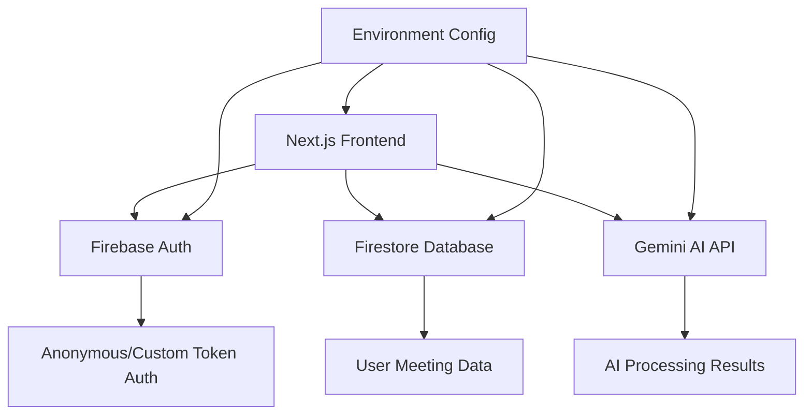

# Design Document

## Overview

This design transforms the existing MeetingAI Next.js application into a fully functional MVP by integrating Firebase authentication, Firestore database, and Google Gemini AI processing. The application will maintain its current UI/UX while adding the core backend functionality needed for production deployment.

The design follows a client-side architecture with direct Firebase and Gemini API integration, optimized for rapid MVP deployment within 24 hours.

## Architecture

### High-Level Architecture



### Data Flow

1. **Authentication Flow**: App loads → Check for custom token → Authenticate → Set user context
2. **Upload Flow**: File selected → Read content → Validate → Send to Gemini → Parse response → Save to Firestore
3. **Display Flow**: Dashboard loads → Fetch user meetings → Display list → Navigate to reports

## Components and Interfaces

### Authentication Service

```typescript
interface AuthService {
  initializeAuth(): Promise<void>
  getCurrentUser(): User | null
  onAuthStateChanged(callback: (user: User | null) => void): void
}
```

**Implementation Details:**
- Check for global `__initial_auth_token` variable
- Use `signInWithCustomToken` if token exists, otherwise `signInAnonymously`
- Maintain auth state across app using React context
- Handle auth errors with user-friendly messages

### File Processing Service

```typescript
interface FileProcessor {
  readFileContent(file: File): Promise<string>
  validateFile(file: File): boolean
  processTranscript(content: string): Promise<ProcessedMeeting>
}

interface ProcessedMeeting {
  summary: string
  actionItems: ActionItem[]
  rawTranscript: string
  metadata: MeetingMetadata
}
```

**Implementation Details:**
- Use FileReader API to extract text content
- Validate file size (max 10MB) and type (.txt, .md)
- Handle encoding issues and special characters
- Provide progress feedback during processing

### Gemini AI Integration

```typescript
interface GeminiService {
  processTranscript(transcript: string): Promise<AIResponse>
  constructPrompt(transcript: string): string
}

interface AIResponse {
  summary: string
  actionItems: ActionItem[]
  confidence: number
}
```

**Prompt Design:**
```
Analyze this meeting transcript and provide a JSON response with:
1. A comprehensive summary (2-3 paragraphs)
2. Action items with suggested owners and deadlines
3. Priority levels for each action item

Format: {
  "summary": "...",
  "actionItems": [
    {
      "description": "...",
      "suggestedOwner": "...",
      "suggestedDeadline": "YYYY-MM-DD",
      "priority": "high|medium|low"
    }
  ]
}

Transcript: [TRANSCRIPT_CONTENT]
```

### Database Service

```typescript
interface DatabaseService {
  saveMeeting(userId: string, meeting: ProcessedMeeting): Promise<string>
  getUserMeetings(userId: string): Promise<Meeting[]>
  getMeetingById(meetingId: string): Promise<Meeting | null>
  subscribeToUserMeetings(userId: string, callback: (meetings: Meeting[]) => void): void
}
```

**Firestore Schema:**
```
/artifacts/{appId}/users/{userId}/meetings/{meetingId}
{
  id: string
  title: string
  date: timestamp
  summary: string
  actionItems: ActionItem[]
  rawTranscript: string
  createdAt: timestamp
  updatedAt: timestamp
}
```

## Data Models

### Core Data Types

```typescript
interface Meeting {
  id: string
  title: string
  date: Date
  summary: string
  actionItems: ActionItem[]
  rawTranscript: string
  createdAt: Date
  updatedAt: Date
}

interface ActionItem {
  id: string
  description: string
  owner?: string
  deadline?: Date
  priority: 'high' | 'medium' | 'low'
  status: 'pending' | 'completed'
}

interface User {
  uid: string
  isAnonymous: boolean
  customClaims?: any
}
```

### Environment Configuration

```typescript
interface AppConfig {
  firebase: {
    apiKey: string
    authDomain: string
    projectId: string
    storageBucket: string
    messagingSenderId: string
    appId: string
  }
  gemini: {
    apiKey: string
    model: string
  }
  app: {
    id: string
  }
}
```

## Error Handling

### Error Categories and Responses

1. **Authentication Errors**
   - Network issues: Retry with exponential backoff
   - Invalid tokens: Fall back to anonymous auth
   - Permission errors: Clear user feedback

2. **File Processing Errors**
   - Invalid file type: Clear validation message
   - File too large: Size limit guidance
   - Encoding issues: Suggest file format

3. **AI Processing Errors**
   - API rate limits: Queue and retry
   - Invalid responses: Fallback parsing
   - Network timeouts: Retry with progress

4. **Database Errors**
   - Connection issues: Offline mode indication
   - Permission errors: Re-authentication prompt
   - Quota exceeded: Usage limit notification

### Error Recovery Strategies

- **Retry Logic**: Exponential backoff for transient failures
- **Fallback Modes**: Graceful degradation when services unavailable
- **User Communication**: Clear, actionable error messages
- **Logging**: Comprehensive error tracking for debugging

## Testing Strategy

### Unit Testing Focus Areas

1. **File Processing Logic**
   - File reading and validation
   - Content extraction accuracy
   - Error handling for various file types

2. **AI Response Parsing**
   - JSON parsing robustness
   - Handling malformed responses
   - Data validation and sanitization

3. **Database Operations**
   - CRUD operations
   - Real-time listener behavior
   - Error handling and retries

### Integration Testing

1. **End-to-End Workflows**
   - Complete file upload to report generation
   - Authentication flow variations
   - Error recovery scenarios

2. **API Integration**
   - Gemini API response handling
   - Firebase service integration
   - Network failure scenarios

### Performance Considerations

- **File Upload**: Progress indicators and chunked processing
- **AI Processing**: Timeout handling and user feedback
- **Database Queries**: Pagination for large meeting lists
- **Caching**: Local storage for frequently accessed data

## Security Considerations

### Data Protection
- Client-side file processing (no server storage)
- Encrypted Firestore data transmission
- Secure API key management

### Authentication Security
- Anonymous user session management
- Custom token validation
- Secure logout and session cleanup

### API Security
- Rate limiting awareness
- API key rotation capability
- Request validation and sanitization

## Deployment Configuration

### Environment Variables Required

```bash
# Firebase Configuration
NEXT_PUBLIC_FIREBASE_API_KEY=
NEXT_PUBLIC_FIREBASE_AUTH_DOMAIN=
NEXT_PUBLIC_FIREBASE_PROJECT_ID=
NEXT_PUBLIC_FIREBASE_STORAGE_BUCKET=
NEXT_PUBLIC_FIREBASE_MESSAGING_SENDER_ID=
NEXT_PUBLIC_FIREBASE_APP_ID=

# Gemini AI Configuration
NEXT_PUBLIC_GEMINI_API_KEY=
NEXT_PUBLIC_GEMINI_MODEL=gemini-2.0-flash

# App Configuration
NEXT_PUBLIC_APP_ID=meeting-ai-mvp
```

### Global Variables Support
- Support for `__app_id`, `__firebase_config`, `__initial_auth_token` globals
- Runtime configuration override capability
- Development vs production environment handling

This design provides a complete technical foundation for implementing all missing functionality while maintaining the existing UI/UX quality and ensuring rapid deployment capability.