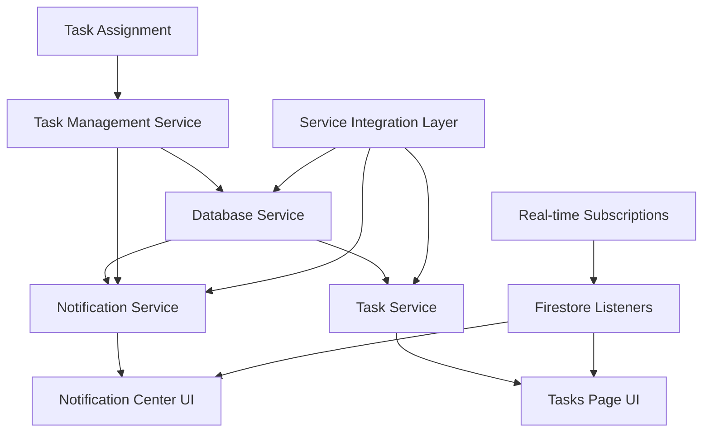

# Notification and Task Display Fixes - Design Document

## Overview

This design addresses the critical notification system and task display issues by fixing service integration problems, method export conflicts, and ensuring proper data flow between the database, notification, and task services. The approach focuses on service layer fixes, proper method binding, and real-time data synchronization.

## Architecture

### Core Problem Analysis

1. **Notification Service Integration**: Methods like `getUserNotifications` and `sendTaskAssignmentNotification` are undefined at runtime
2. **Database Service Exports**: Duplicate exports causing method binding issues
3. **Task Display Issues**: Tasks not appearing on the tasks page despite being assigned
4. **Service Layer Disconnection**: Services not properly integrated with each other
5. **Real-time Updates**: Notification and task subscriptions not working correctly

### Solution Architecture



## Components and Interfaces

### 1. Fixed Database Service

**Purpose**: Ensure all database methods are properly exported and accessible

**Changes**:
- Remove duplicate exports
- Ensure proper method binding
- Add missing notification and task methods
- Fix export conflicts

**Interface**:
```typescript
interface DatabaseService {
  // Notification methods
  getUserNotifications(userId: string): Promise<Notification[]>;
  createNotification(notification: CreateNotificationData): Promise<string>;
  markNotificationAsRead(notificationId: string): Promise<boolean>;
  subscribeToUserNotifications(userId: string, callback: (notifications: Notification[]) => void): () => void;
  
  // Task methods
  getUserMeetings(userId: string): Promise<Meeting[]>;
  getTeamMeetings(teamId: string): Promise<Meeting[]>;
  assignTask(meetingId: string, taskIndex: number, assigneeId: string, assignedBy: string): Promise<boolean>;
  updateTaskStatus(meetingId: string, taskId: string, status: ActionItem['status']): Promise<boolean>;
}
```

### 2. Enhanced Notification Service

**Purpose**: Provide a complete notification service with all required methods

**Interface**:
```typescript
interface NotificationService {
  // Core notification methods
  getUserNotifications(userId: string): Promise<Notification[]>;
  getUnreadCount(userId: string): Promise<number>;
  markAsRead(notificationId: string): Promise<void>;
  subscribeToNotifications(userId: string, callback: (notifications: Notification[]) => void): () => void;
  
  // Task assignment notifications
  sendTaskAssignmentNotification(
    taskId: string,
    taskDescription: string,
    assigneeId: string,
    assigneeName: string,
    meetingTitle: string,
    assignedBy: string,
    teamId?: string,
    teamName?: string
  ): Promise<void>;
  
  // Team invitation methods
  acceptTeamInvitation(notificationId: string, userId: string): Promise<void>;
  declineTeamInvitation(notificationId: string, userId: string): Promise<void>;
  deleteNotification(notificationId: string): Promise<void>;
}
```

**Implementation**:
- Wrap notification management service with proper method binding
- Add missing methods that the UI expects
- Ensure all methods are properly exported and accessible
- Handle errors gracefully with fallbacks

### 3. Fixed Task Service Integration

**Purpose**: Ensure task service properly retrieves and manages user tasks

**Interface**:
```typescript
interface TaskService {
  getUserTasks(userId: string): Promise<TaskWithContext[]>;
  subscribeToUserTasks(userId: string, callback: (tasks: TaskWithContext[]) => void): () => void;
  updateTaskStatus(taskId: string, meetingId: string, status: ActionItem['status'], userId: string): Promise<void>;
  getTeamTasks(teamId: string): Promise<TaskWithContext[]>;
}
```

**Implementation**:
- Fix task retrieval to include all user-assigned tasks
- Ensure proper integration with database service
- Add real-time task subscriptions
- Handle team task context properly

### 4. Task Assignment Integration

**Purpose**: Ensure task assignments trigger notifications and update displays

**Flow**:
1. Task is assigned through UI or automatic processing
2. Database service updates the meeting with task assignment
3. Task assignment service sends notification
4. Notification appears in user's notification center
5. Task appears on user's tasks page
6. Real-time updates propagate to all connected clients

**Interface**:
```typescript
interface TaskAssignmentFlow {
  assignTask(meetingId: string, taskIndex: number, assigneeId: string, assignedBy: string): Promise<{
    success: boolean;
    notificationSent: boolean;
    taskVisible: boolean;
  }>;
}
```

### 5. Real-time Update System

**Purpose**: Ensure notifications and tasks update in real-time across all clients

**Components**:
- Firestore real-time listeners for notifications
- Firestore real-time listeners for meetings/tasks
- Client-side subscription management
- Offline/online synchronization

**Implementation**:
```typescript
interface RealTimeSystem {
  subscribeToUserNotifications(userId: string): () => void;
  subscribeToUserTasks(userId: string): () => void;
  handleOfflineSync(): void;
  handleConnectionStateChange(isOnline: boolean): void;
}
```

## Data Models

### Enhanced Notification Model

```typescript
interface Notification {
  id: string;
  userId: string;
  type: 'team_invitation' | 'task_assignment' | 'meeting_update' | 'task_completed';
  title: string;
  message: string;
  read: boolean;
  createdAt: Date;
  data: {
    // Task assignment specific
    taskId?: string;
    meetingId?: string;
    meetingTitle?: string;
    assignedBy?: string;
    
    // Team invitation specific
    teamId?: string;
    teamName?: string;
    invitedBy?: string;
    
    // Meeting update specific
    updateType?: string;
  };
}
```

### Task Context Model

```typescript
interface TaskWithContext {
  id: string;
  description: string;
  assigneeId: string;
  assigneeName: string;
  status: 'pending' | 'in_progress' | 'completed';
  priority: 'low' | 'medium' | 'high';
  deadline?: Date;
  
  // Meeting context
  meetingId: string;
  meetingTitle: string;
  meetingDate: Date;
  
  // Team context
  teamId?: string;
  teamName?: string;
  
  // Assignment context
  assignedBy: string;
  assignedAt: Date;
  createdAt: Date;
}
```

## Error Handling

### Service Integration Errors

1. **Method Not Found Errors**: Catch undefined method calls and provide fallbacks
2. **Service Initialization Errors**: Ensure services are properly initialized before use
3. **Circular Dependency Errors**: Resolve service dependency issues
4. **Export Conflicts**: Fix duplicate exports and method binding issues

### Notification Errors

1. **Notification Creation Failures**: Log errors but don't block task assignment
2. **Real-time Subscription Errors**: Provide fallback to polling
3. **Permission Errors**: Handle Firestore permission issues gracefully
4. **Network Errors**: Queue notifications for retry when online

### Task Display Errors

1. **Task Retrieval Failures**: Show error state with retry option
2. **Real-time Update Failures**: Fall back to manual refresh
3. **Filter/Sort Errors**: Provide default sorting and filtering
4. **Status Update Errors**: Show error message and revert UI state

## Testing Strategy

### Unit Tests

- Database service method exports and binding
- Notification service method availability
- Task service integration with database
- Error handling for undefined methods
- Real-time subscription management

### Integration Tests

- End-to-end task assignment with notifications
- Notification center loading and display
- Tasks page data retrieval and display
- Real-time updates across multiple clients
- Service layer integration

### Error Scenario Tests

- Undefined method error handling
- Network failure recovery
- Service initialization failures
- Real-time subscription failures
- Data synchronization issues

## Implementation Plan

### Phase 1: Fix Database Service Exports
- Remove duplicate exports
- Ensure proper method binding
- Add missing methods
- Test service accessibility

### Phase 2: Fix Notification Service Integration
- Implement missing notification methods
- Ensure proper service wrapping
- Add error handling and fallbacks
- Test notification functionality

### Phase 3: Fix Task Service Integration
- Ensure task retrieval works correctly
- Add real-time task subscriptions
- Fix task display on tasks page
- Test task management workflow

### Phase 4: Fix Task Assignment Notifications
- Ensure task assignments trigger notifications
- Test notification delivery
- Verify real-time updates
- Test error scenarios

### Phase 5: Integration Testing
- Test complete workflow end-to-end
- Verify real-time updates work
- Test error handling and recovery
- Performance optimization

## Monitoring and Observability

- Service method call success/failure rates
- Notification delivery success rates
- Task display and update success rates
- Real-time subscription health
- Error occurrence tracking
- User experience metrics