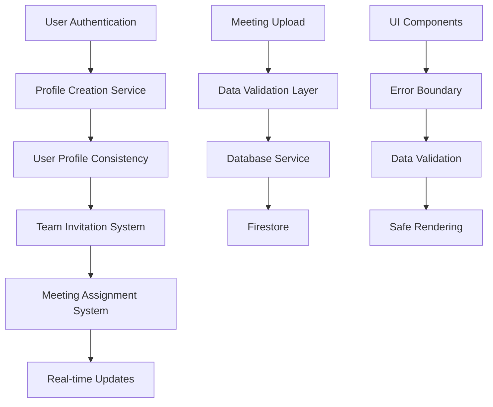

# System Integration Fixes - Design Document

## Overview

This design addresses the critical integration issues in the MeetingAI system by implementing systematic fixes across the meeting upload system, user profile management, team invitation workflow, and UI components. The approach focuses on data validation, consistent user ID handling, and robust error handling.

## Architecture

### Core Problem Analysis

1. **Meeting Upload Issues**: `teamId` field being set to `undefined` instead of being omitted
2. **User Profile Inconsistency**: Profiles not created consistently across collections
3. **Team Invitation ID Mismatch**: Still using temporary IDs in some code paths
4. **UI Component Errors**: Select components with empty values
5. **Real-time Listener Errors**: Permission and data consistency issues

### Solution Architecture



## Components and Interfaces

### 1. Data Validation Layer

**Purpose**: Ensure all database operations use valid data

**Interface**:
```typescript
interface DataValidator {
  validateMeetingData(meeting: ProcessedMeeting, teamId?: string): ValidatedMeetingData;
  validateUserProfile(user: User): ValidatedUserProfile;
  validateTeamMember(member: TeamMember): ValidatedTeamMember;
  sanitizeUndefinedFields<T>(data: T): T;
}
```

**Implementation**:
- Remove undefined fields before database operations
- Provide default values for required fields
- Validate data types and constraints
- Handle optional fields properly

### 2. User Profile Consistency Service

**Purpose**: Ensure user profiles are created and maintained consistently

**Interface**:
```typescript
interface UserProfileConsistencyService {
  ensureUserProfile(user: User): Promise<void>;
  reconcileUserData(userId: string): Promise<void>;
  createMissingProfiles(): Promise<void>;
  validateUserSearchability(email: string): Promise<User | null>;
}
```

**Implementation**:
- Create profiles in both `users` and `userProfiles` collections
- Reconcile data inconsistencies automatically
- Ensure searchable user data for team invitations
- Handle authentication-to-profile mapping

### 3. Enhanced Team Service

**Purpose**: Fix team invitation workflow with consistent user IDs

**Interface**:
```typescript
interface EnhancedTeamService extends TeamService {
  validateUserExists(email: string): Promise<User>;
  inviteUserWithValidation(teamId: string, inviterUserId: string, email: string, displayName: string): Promise<void>;
  acceptInvitationWithCleanup(invitationId: string, userId: string): Promise<void>;
  ensureTeamMembershipConsistency(teamId: string): Promise<void>;
}
```

**Implementation**:
- Strict user existence validation before invitations
- Consistent real user ID usage throughout
- Proper cleanup of temporary records
- Real-time membership updates

### 4. Meeting Data Service

**Purpose**: Handle meeting uploads with proper data validation

**Interface**:
```typescript
interface MeetingDataService {
  saveMeetingWithValidation(userId: string, meeting: ProcessedMeeting, teamId?: string): Promise<string>;
  validateMeetingFields(meeting: ProcessedMeeting): ProcessedMeeting;
  handleTeamAssignment(meetingId: string, teamId: string): Promise<void>;
}
```

**Implementation**:
- Validate all fields before database insertion
- Handle optional teamId properly (omit if undefined)
- Ensure metadata has default values
- Proper error handling and user feedback

### 5. UI Error Handling Layer

**Purpose**: Prevent UI component errors and handle edge cases

**Interface**:
```typescript
interface UIErrorHandler {
  validateSelectOptions(options: SelectOption[]): SelectOption[];
  handleEmptyData<T>(data: T[], fallback: T[]): T[];
  safeRender<T>(component: React.ComponentType<T>, props: T): React.ReactElement;
}
```

**Implementation**:
- Validate Select component values are non-empty
- Provide fallback data for empty states
- Graceful error boundaries
- Safe data rendering patterns

## Data Models

### Enhanced Meeting Data Model

```typescript
interface ValidatedMeetingData {
  title: string;
  date: Timestamp;
  summary: string;
  actionItems: ActionItem[];
  rawTranscript: string;
  teamId?: string; // Optional, omitted if undefined
  createdAt: Timestamp;
  updatedAt: Timestamp;
  metadata: {
    fileName: string;
    fileSize: number;
    uploadedAt: Timestamp;
    processingTime: number;
  };
}
```

### Consistent User Profile Model

```typescript
interface ConsistentUserProfile {
  uid: string;
  email: string;
  displayName: string;
  photoURL?: string;
  createdAt: Timestamp;
  updatedAt: Timestamp;
  searchable: boolean; // For team invitation searches
  profileComplete: boolean;
}
```

### Enhanced Team Member Model

```typescript
interface ValidatedTeamMember {
  userId: string; // Always real Firebase Auth UID
  email: string;
  displayName: string;
  role: 'admin' | 'member';
  status: 'active' | 'invited';
  joinedAt: Timestamp;
  invitedAt?: Timestamp;
  invitedBy?: string;
}
```

## Error Handling

### Database Error Handling

1. **Validation Errors**: Catch undefined field errors before database operations
2. **Permission Errors**: Provide user-friendly messages and retry logic
3. **Network Errors**: Implement exponential backoff and offline handling
4. **Data Consistency Errors**: Automatic reconciliation and repair

### UI Error Handling

1. **Component Errors**: Error boundaries with fallback UI
2. **Data Loading Errors**: Loading states and error messages
3. **Real-time Update Errors**: Graceful degradation to manual refresh
4. **Form Validation Errors**: Clear user feedback and guidance

### Integration Error Handling

1. **Team Invitation Errors**: Clear error messages and retry options
2. **Meeting Upload Errors**: Detailed error information and suggestions
3. **User Search Errors**: Fallback search methods and user guidance
4. **Real-time Listener Errors**: Automatic reconnection and error recovery

## Testing Strategy

### Unit Tests

- Data validation functions
- User profile consistency logic
- Team invitation workflow steps
- Meeting data processing
- UI component error handling

### Integration Tests

- End-to-end team invitation workflow
- Meeting upload and team assignment
- User profile creation and search
- Real-time listener functionality
- Database operation validation

### Error Scenario Tests

- Undefined field handling
- Permission error recovery
- Network failure handling
- Data inconsistency resolution
- UI component error boundaries

## Implementation Plan

### Phase 1: Data Validation Layer
- Implement data validation utilities
- Add undefined field sanitization
- Update database service with validation
- Test with existing data

### Phase 2: User Profile Consistency
- Implement profile consistency service
- Add automatic profile creation on sign-in
- Reconcile existing user data
- Update user search functionality

### Phase 3: Team Invitation Fixes
- Update team service with strict validation
- Fix user ID consistency issues
- Implement proper cleanup logic
- Test invitation workflow end-to-end

### Phase 4: Meeting Upload Fixes
- Add meeting data validation
- Fix teamId handling
- Update metadata processing
- Test upload functionality

### Phase 5: UI Error Handling
- Add Select component validation
- Implement error boundaries
- Update data loading patterns
- Test UI error scenarios

### Phase 6: Integration Testing
- Test complete workflows
- Verify real-time updates
- Validate error handling
- Performance optimization

## Monitoring and Observability

- Database operation success/failure rates
- User profile creation consistency
- Team invitation completion rates
- Meeting upload success rates
- UI error occurrence tracking
- Real-time listener health monitoring